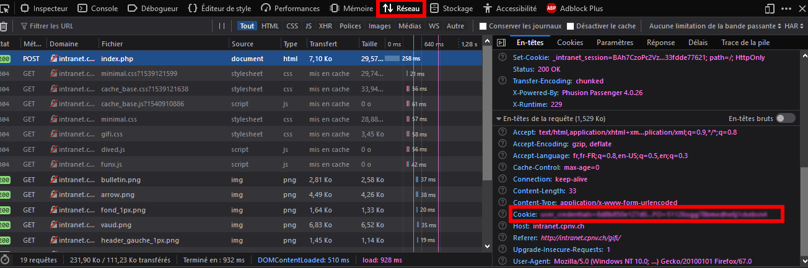

# GifiObserver

GifiObserver is a script done for [CPNV's](https://www.cpnv.ch/) students that are in IT section and that have their marks put on Gifi system (<<cpnv's intranet link>>.ch/gifi/index.php)

### What's the purpose ?

This is mostly used because refreshing manually the Gifi page to look whether there is a new mark or not is time consuming. GifiObserver does the job and notify you when a new mark is detected.

## Installation

- `git clone https://github.com/Dardanboy/GifiObserver.git`
- `cd GifiObserver`
- `bundle install`
  - If bundle is not recognized, install it with `gem install bundle`

#### Cookie

When you're done, you have to add your actual intranet cookie so that the script can access your gifi's page data locally and notify you when there's a new change.

To do so, you can use any web browser that can show you headers:

1. Go to CPNV's intranet
2. Connect if not done yet
3. Get cookie: 

##### Firefox / Google chrome

- `Right click` on the page 
- Select `Inspect element`
- Go to `Network` tab
- Select a request from left list and copy what's inside `Cookie: ` and paste it into the `main.rb` in: 

```ruby
gifi_observer.set_cookie("COOKIE for intranet.cpnv.ch HERE !")
```



### Launch it

- When it's done just launch the script with `ruby main.rb` 

### Limitation

For now, a `MessageBox` is used to show when there is a change detected but only on `Windows`os, on other ones the message is displayed in the standard output (console).